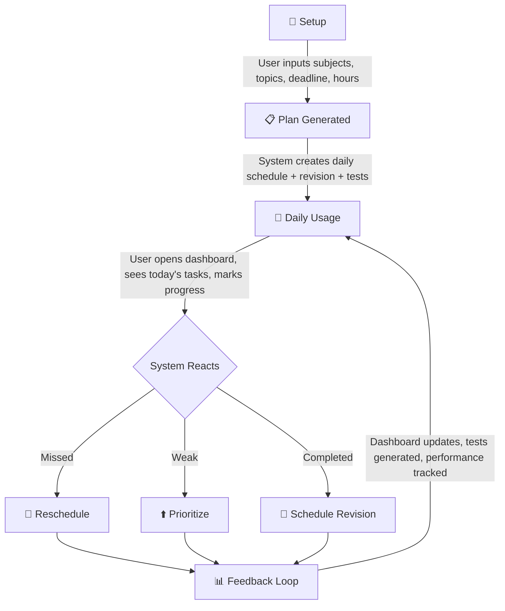
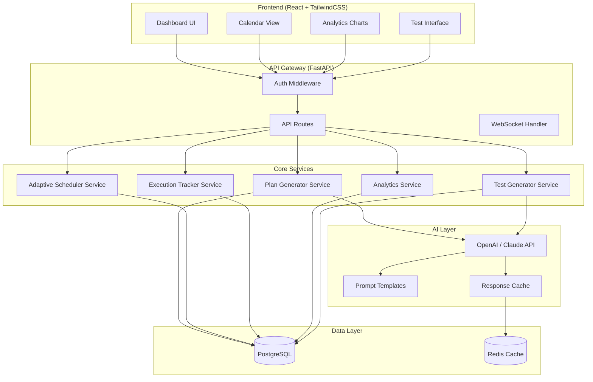
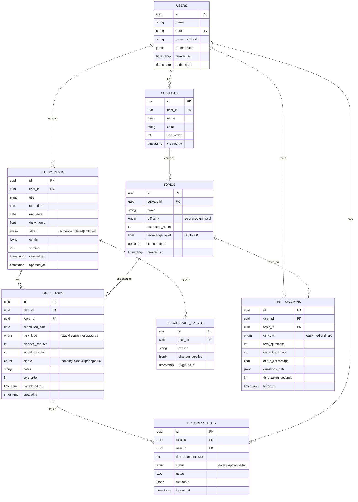
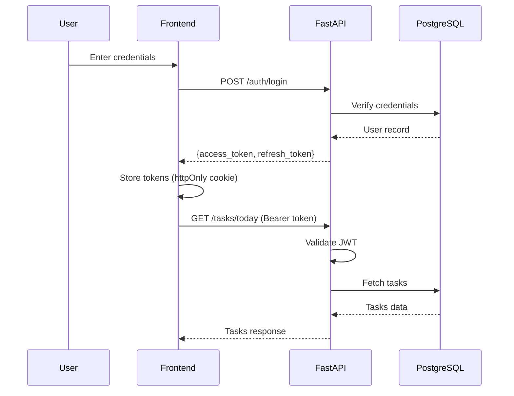
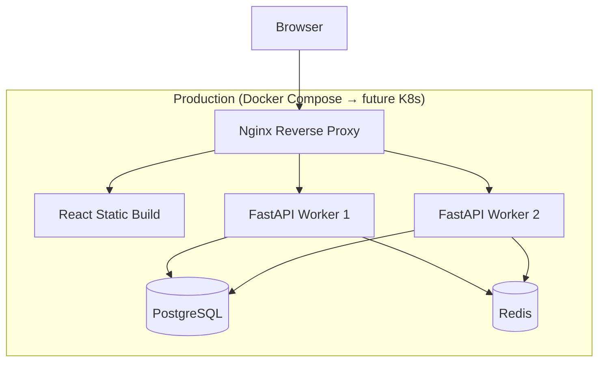

# 🧠 NeuroPlan AI — System Architecture & Product Blueprint

> **Adaptive Study Execution Agent**
> *An AI agent that doesn't just plan your studies — it ensures you actually follow through and improve.*

---

## 1. Problem Statement

Students don't fail because they lack resources — they fail because:

| Failure Mode | Root Cause | NeuroPlan Solution |
|---|---|---|
| Don't know what to study daily | No structured planning | **Study Plan Generator** |
| Overestimate consistency | Optimistic scheduling | **Adaptive Rescheduler** |
| Don't adapt when falling behind | Static plans | **Real-time Redistribution** |
| Don't revise properly | No spaced repetition | **Auto Revision Slots** |
| Avoid difficult topics | Procrastination | **Weak Topic Prioritization** |

> [!IMPORTANT]
> **Core Gap:** Existing tools (Notion, Google Calendar, to-do apps) *plan*, but do NOT *adapt*, *enforce*, or *think*.

---

## 2. Core Value Proposition

```
This is:
  ❌ Not a planner
  ❌ Not a chatbot
  ✅ An execution + adaptation system
```

NeuroPlan AI is an **intelligent study execution engine** that:
1. **Generates** optimized study plans with revision cycles
2. **Tracks** daily execution with granular status
3. **Adapts** in real-time when plans deviate from reality
4. **Analyzes** performance to surface weak areas
5. **Tests** knowledge retention with auto-generated assessments

---

## 3. Feature Breakdown (Prioritized)

### 🟢 MUST-HAVE — MVP (V1)

#### 3.1 Study Plan Generator
- **Input:** Subjects, topics per subject, deadline, daily available hours
- **Output:** Day-wise structured plan with:
  - Topic allocation weighted by difficulty
  - Built-in revision slots (spaced at 1, 3, 7 days)
  - Practice/test blocks
  - Buffer days for catch-up

#### 3.2 Daily Execution Tracker
- Task statuses: ✅ Done | ❌ Skipped | ⏳ Partial
- Time tracking: actual vs. planned duration
- Session notes (optional)
- Streak counter for motivation

#### 3.3 Adaptive Rescheduler (CORE ENGINE)
- **Trigger:** User misses or partially completes tasks
- **Actions:**
  - Redistribute missed topics to upcoming days
  - Prioritize weak/skipped topics higher
  - Maintain workload within daily hour limits
  - Preserve deadline integrity
  - Compress low-priority revision if needed
- **Algorithm:** Weighted priority queue with constraint satisfaction

#### 3.4 Basic Analytics Dashboard
- Completion percentage (daily / weekly / overall)
- Daily study time chart
- Missed tasks heatmap
- Subject-wise progress bars
- Streak visualization

#### 3.5 Test Generator (Basic)
- Topic-based question generation via AI
- Difficulty levels: Easy / Medium / Hard
- Auto-scoring for MCQs
- Performance tracking per topic

### 🟡 IMPORTANT — V2

| Feature | Description |
|---|---|
| Spaced Repetition Engine | Auto-schedule revision based on performance + time gaps |
| Weak Topic Detection | Detect weak areas from test scores + skip patterns |
| Procrastination Detection | Identify delay patterns, break topics smaller, suggest "start easy" tasks |

### 🔴 ADVANCED — V3

| Feature | Description |
|---|---|
| AI Study Coach | Daily personalized feedback and recommendations |
| Mock Interview Mode | AI-driven Q&A with answer evaluation |
| Automation Layer | Smart reminders, notifications, nudges |

---

## 4. Scope Boundaries

### ❌ NOT Included (Current Phase)
- Full voice assistant
- Browser activity tracking
- Native mobile app (web-first)
- Real-time surveillance tracking
- Social/collaborative features

### ✅ Focus Areas
- Web-based responsive dashboard
- Manual + intelligent tracking
- Strong backend scheduling logic
- AI-powered content generation

---

## 5. User Flow



### Detailed Flow:

**Step 1: Setup**
- User creates account → onboarding wizard
- Input: subjects, topics (with difficulty), deadline, daily hours
- Optional: existing knowledge level per topic

**Step 2: Plan Generation**
- AI generates optimized daily schedule
- Includes: study blocks, revision slots, test blocks, buffer days
- User can review and tweak before confirming

**Step 3: Daily Execution**
- Dashboard shows today's tasks with time estimates
- User marks: ✅ done / ❌ skipped / ⏳ partial
- Logs actual time spent

**Step 4: Adaptive Response**
- System detects deviations from plan
- Runs rescheduling algorithm
- Updates future days automatically
- Notifies user of changes

**Step 5: Feedback Loop**
- Analytics dashboard updates in real-time
- Tests generated for completed topics
- Performance trends visualized

---

## 6. System Architecture

### 6.1 High-Level Architecture



### 6.2 Backend Architecture (FastAPI)

```
backend/
├── app/
│   ├── main.py                    # FastAPI application entry point
│   ├── config.py                  # Environment & app configuration
│   ├── database.py                # Database connection & session management
│   │
│   ├── api/
│   │   ├── __init__.py
│   │   ├── deps.py                # Shared dependencies (auth, db session)
│   │   └── v1/
│   │       ├── __init__.py
│   │       ├── router.py          # Main API router
│   │       ├── auth.py            # Authentication endpoints
│   │       ├── users.py           # User profile endpoints
│   │       ├── subjects.py        # Subject CRUD
│   │       ├── topics.py          # Topic CRUD
│   │       ├── plans.py           # Plan generation & management
│   │       ├── tasks.py           # Daily task endpoints
│   │       ├── progress.py        # Progress tracking endpoints
│   │       ├── analytics.py       # Analytics endpoints
│   │       └── tests.py           # Test generation & results
│   │
│   ├── models/
│   │   ├── __init__.py
│   │   ├── user.py                # User SQLAlchemy model
│   │   ├── subject.py             # Subject model
│   │   ├── topic.py               # Topic model
│   │   ├── study_plan.py          # Study plan model
│   │   ├── daily_task.py          # Daily task model
│   │   ├── progress_log.py        # Progress log model
│   │   └── test_result.py         # Test result model
│   │
│   ├── schemas/
│   │   ├── __init__.py
│   │   ├── user.py                # Pydantic schemas for users
│   │   ├── subject.py             # Subject schemas
│   │   ├── topic.py               # Topic schemas
│   │   ├── plan.py                # Plan schemas
│   │   ├── task.py                # Task schemas
│   │   ├── progress.py            # Progress schemas
│   │   └── test.py                # Test schemas
│   │
│   ├── services/
│   │   ├── __init__.py
│   │   ├── plan_generator.py      # Study plan generation logic
│   │   ├── adaptive_scheduler.py  # Rescheduling algorithm
│   │   ├── execution_tracker.py   # Task tracking logic
│   │   ├── analytics_engine.py    # Analytics computation
│   │   ├── test_generator.py      # AI-powered test generation
│   │   └── ai_client.py           # LLM API wrapper
│   │
│   ├── core/
│   │   ├── __init__.py
│   │   ├── security.py            # JWT, password hashing
│   │   ├── exceptions.py          # Custom exception classes
│   │   └── constants.py           # App-wide constants
│   │
│   └── utils/
│       ├── __init__.py
│       ├── scheduling.py          # Scheduling utility functions
│       └── date_helpers.py        # Date manipulation helpers
│
├── alembic/                       # Database migrations
│   ├── versions/
│   └── env.py
│
├── tests/
│   ├── conftest.py
│   ├── test_plan_generator.py
│   ├── test_adaptive_scheduler.py
│   ├── test_execution_tracker.py
│   └── test_analytics.py
│
├── alembic.ini
├── requirements.txt
├── Dockerfile
└── .env.example
```

### 6.3 Frontend Architecture (React + Vite + TailwindCSS)

```
frontend/
├── public/
│   └── favicon.ico
├── src/
│   ├── main.jsx                   # App entry point
│   ├── App.jsx                    # Root component + routing
│   │
│   ├── api/
│   │   ├── client.js              # Axios instance with interceptors
│   │   ├── auth.js                # Auth API calls
│   │   ├── plans.js               # Plan API calls
│   │   ├── tasks.js               # Task API calls
│   │   ├── analytics.js           # Analytics API calls
│   │   └── tests.js               # Test API calls
│   │
│   ├── components/
│   │   ├── layout/
│   │   │   ├── Sidebar.jsx
│   │   │   ├── Header.jsx
│   │   │   ├── MainLayout.jsx
│   │   │   └── MobileNav.jsx
│   │   │
│   │   ├── dashboard/
│   │   │   ├── TodayTasks.jsx     # Today's task list
│   │   │   ├── ProgressRing.jsx   # Circular progress indicator
│   │   │   ├── StreakCounter.jsx   # Study streak display
│   │   │   └── QuickStats.jsx     # Summary statistics
│   │   │
│   │   ├── plan/
│   │   │   ├── PlanWizard.jsx     # Multi-step plan creation
│   │   │   ├── SubjectInput.jsx   # Subject entry form
│   │   │   ├── TopicInput.jsx     # Topic entry with difficulty
│   │   │   ├── ScheduleConfig.jsx # Deadline & hours config
│   │   │   └── PlanPreview.jsx    # Generated plan preview
│   │   │
│   │   ├── calendar/
│   │   │   ├── CalendarView.jsx   # Monthly/weekly calendar
│   │   │   ├── DayDetail.jsx      # Detailed day view
│   │   │   └── TaskCard.jsx       # Individual task card
│   │   │
│   │   ├── analytics/
│   │   │   ├── CompletionChart.jsx
│   │   │   ├── StudyTimeChart.jsx
│   │   │   ├── SubjectProgress.jsx
│   │   │   └── MissedTasksHeatmap.jsx
│   │   │
│   │   ├── tests/
│   │   │   ├── TestInterface.jsx  # Test-taking UI
│   │   │   ├── QuestionCard.jsx   # Individual question
│   │   │   └── TestResults.jsx    # Results display
│   │   │
│   │   └── shared/
│   │       ├── Button.jsx
│   │       ├── Card.jsx
│   │       ├── Modal.jsx
│   │       ├── LoadingSpinner.jsx
│   │       └── EmptyState.jsx
│   │
│   ├── pages/
│   │   ├── LoginPage.jsx
│   │   ├── RegisterPage.jsx
│   │   ├── DashboardPage.jsx
│   │   ├── PlanPage.jsx
│   │   ├── CalendarPage.jsx
│   │   ├── AnalyticsPage.jsx
│   │   ├── TestPage.jsx
│   │   └── SettingsPage.jsx
│   │
│   ├── hooks/
│   │   ├── useAuth.js
│   │   ├── usePlan.js
│   │   ├── useTasks.js
│   │   └── useAnalytics.js
│   │
│   ├── context/
│   │   ├── AuthContext.jsx
│   │   └── ThemeContext.jsx
│   │
│   ├── utils/
│   │   ├── formatters.js
│   │   ├── validators.js
│   │   └── constants.js
│   │
│   └── styles/
│       └── index.css              # TailwindCSS imports + custom styles
│
├── index.html
├── tailwind.config.js
├── vite.config.js
├── package.json
└── .env.example
```

---

## 7. Data Model

### 7.1 Entity Relationship Diagram



### 7.2 Key Design Decisions

| Decision | Rationale |
|---|---|
| UUIDs as primary keys | Prevent enumeration attacks, support distributed systems |
| `jsonb` for config/metadata | Flexible schema evolution without migrations |
| `version` on study_plans | Track plan iterations from rescheduling |
| Separate `progress_logs` table | Audit trail + analytics without modifying task records |
| `reschedule_events` table | Transparency into what the system changed and why |
| `knowledge_level` on topics | Feed into adaptive algorithm for prioritization |

---

## 8. API Design

### 8.1 Authentication
```
POST   /api/v1/auth/register        # Create account
POST   /api/v1/auth/login            # Get JWT tokens
POST   /api/v1/auth/refresh          # Refresh access token
POST   /api/v1/auth/logout           # Invalidate token
```

### 8.2 User Management
```
GET    /api/v1/users/me              # Get current user profile
PUT    /api/v1/users/me              # Update profile
PUT    /api/v1/users/me/preferences  # Update preferences
```

### 8.3 Subjects & Topics
```
GET    /api/v1/subjects              # List user's subjects
POST   /api/v1/subjects              # Create subject
PUT    /api/v1/subjects/{id}         # Update subject
DELETE /api/v1/subjects/{id}         # Delete subject

GET    /api/v1/subjects/{id}/topics  # List topics for subject
POST   /api/v1/topics                # Create topic
PUT    /api/v1/topics/{id}           # Update topic
DELETE /api/v1/topics/{id}           # Delete topic
```

### 8.4 Study Plans
```
POST   /api/v1/plans/generate        # Generate new plan (AI)
GET    /api/v1/plans                  # List all plans
GET    /api/v1/plans/{id}            # Get plan details
PUT    /api/v1/plans/{id}            # Update plan settings
POST   /api/v1/plans/{id}/activate   # Set as active plan
DELETE /api/v1/plans/{id}            # Archive plan
```

### 8.5 Daily Tasks
```
GET    /api/v1/tasks/today           # Get today's tasks
GET    /api/v1/tasks?date=YYYY-MM-DD # Get tasks for specific date
GET    /api/v1/tasks?week=current    # Get current week's tasks
PUT    /api/v1/tasks/{id}/status     # Update task status
PUT    /api/v1/tasks/{id}/time       # Log actual time spent
POST   /api/v1/tasks/{id}/notes      # Add notes to task
```

### 8.6 Rescheduling
```
POST   /api/v1/plans/{id}/reschedule        # Trigger manual reschedule
GET    /api/v1/plans/{id}/reschedule-preview # Preview reschedule changes
GET    /api/v1/plans/{id}/reschedule-history # View past reschedules
```

### 8.7 Analytics
```
GET    /api/v1/analytics/overview            # Overall stats
GET    /api/v1/analytics/daily?range=7d      # Daily breakdown
GET    /api/v1/analytics/subjects            # Per-subject stats
GET    /api/v1/analytics/streaks             # Streak data
GET    /api/v1/analytics/completion-trend    # Completion over time
```

### 8.8 Tests
```
POST   /api/v1/tests/generate               # Generate test (AI)
GET    /api/v1/tests                         # List past tests
GET    /api/v1/tests/{id}                    # Get test details
POST   /api/v1/tests/{id}/submit            # Submit test answers
GET    /api/v1/tests/performance             # Test performance stats
```

---

## 9. Adaptive Rescheduler — Algorithm Design

### 9.1 Core Algorithm

```
ALGORITHM: AdaptiveReschedule(plan, missed_tasks, current_date)

INPUT:
  - plan: active study plan
  - missed_tasks: list of tasks marked skipped/partial today
  - current_date: today's date

PROCESS:
  1. COLLECT remaining tasks and available days until deadline
  2. CALCULATE available capacity per day (daily_hours - already_scheduled)

  3. FOR each missed_task:
     a. GET topic difficulty and knowledge_level
     b. COMPUTE priority_score:
        - base_priority = difficulty_weight × (1 - knowledge_level)
        - skip_penalty = consecutive_skips × SKIP_MULTIPLIER
        - deadline_urgency = 1 / days_until_deadline
        - priority_score = base_priority + skip_penalty + deadline_urgency

  4. SORT missed_tasks by priority_score (descending)

  5. FOR each missed_task (highest priority first):
     a. FIND nearest available day with capacity
     b. IF no capacity before deadline:
        - COMPRESS low-priority revision tasks
        - MERGE similar topic sessions
     c. ASSIGN task to best available slot
     d. UPDATE day's remaining capacity

  6. VALIDATE:
     - No day exceeds daily_hours limit
     - All critical topics covered before deadline
     - At least 1 buffer day remains

  7. LOG reschedule_event with changes

  8. RETURN updated_plan

OUTPUT:
  - Restructured plan with redistributed tasks
  - List of changes made (for user transparency)
```

### 9.2 Priority Scoring

```
priority_score = (
    0.3 × difficulty_weight +            # hard=1.0, medium=0.6, easy=0.3
    0.25 × (1 - knowledge_level) +       # lower knowledge = higher priority
    0.2 × (skip_count / total_sessions) + # frequently skipped = boosted
    0.15 × (1 / days_remaining) +         # deadline pressure
    0.1 × revision_overdue_factor         # overdue revision = urgent
)
```

---

## 10. Technology Stack

| Layer | Technology | Justification |
|---|---|---|
| **Backend Framework** | FastAPI (Python 3.11+) | Async, fast, auto-docs, Pydantic validation |
| **Database** | PostgreSQL 15+ | ACID compliance, JSONB support, mature ecosystem |
| **ORM** | SQLAlchemy 2.0 + Alembic | Async support, type safety, migrations |
| **Auth** | JWT (python-jose) + bcrypt | Stateless, scalable authentication |
| **Cache** | Redis | Session cache, rate limiting, response caching |
| **AI/LLM** | OpenAI GPT-4 / Claude API | Plan generation, test creation, coaching |
| **Frontend Framework** | React 18 + Vite | Fast dev experience, component ecosystem |
| **Styling** | TailwindCSS 3.x | Utility-first, rapid UI development |
| **Charts** | Recharts | React-native, declarative, responsive |
| **State Management** | Zustand / React Context | Lightweight, no boilerplate |
| **HTTP Client** | Axios | Interceptors, request/response transforms |
| **Containerization** | Docker + Docker Compose | Reproducible dev/prod environments |
| **CI/CD** | GitHub Actions | Automated testing and deployment |

---

## 11. Security Architecture

### 11.1 Authentication Flow


### 11.2 Security Measures
- **Password hashing:** bcrypt with salt rounds
- **JWT tokens:** Short-lived access (15min), long-lived refresh (7d)
- **CORS:** Strict origin whitelist
- **Rate limiting:** Redis-backed per-user rate limits
- **Input validation:** Pydantic schemas on all endpoints
- **SQL injection:** Parameterized queries via SQLAlchemy ORM
- **XSS protection:** React's built-in escaping + CSP headers

---

## 12. Deployment Architecture



### Environment Strategy
| Environment | Purpose | Infrastructure |
|---|---|---|
| **Local** | Development | Docker Compose (all services) |
| **Staging** | Testing & QA | Single VM / Docker Compose |
| **Production** | Live users | Multi-container with Nginx |

---

## 13. Success Metrics

| Metric | Target | Measurement |
|---|---|---|
| Daily Active Users | User logs in daily | Login frequency tracking |
| Task Completion Rate | >70% tasks marked done | `done_tasks / total_tasks` |
| Plan Adherence | Completion rate increases week-over-week | Trend analysis |
| Missed Task Reduction | Missed tasks decrease over time | Sliding window comparison |
| Test Performance | Scores improve per-topic | Pre/post test comparison |
| Reschedule Effectiveness | Users don't abandon plans after reschedule | Plan abandonment rate |

---

## 14. Non-Functional Requirements

| Requirement | Target |
|---|---|
| **Response Time** | API < 200ms (p95), AI endpoints < 5s |
| **Availability** | 99.5% uptime |
| **Scalability** | Support 1000 concurrent users (V1) |
| **Data Retention** | 1 year of progress history |
| **Browser Support** | Chrome, Firefox, Safari, Edge (latest 2 versions) |
| **Mobile Responsive** | Full functionality on tablet + mobile viewports |
| **Accessibility** | WCAG 2.1 AA compliance |

---

*Document Version: 1.0*
*Created: April 10, 2026*
*Author: NeuroPlan AI Team*
