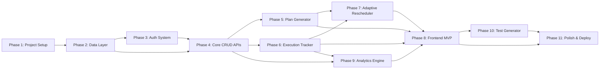

# 🚀 NeuroPlan AI — Implementation Plan V1

> **Detailed Phase-by-Phase Implementation Guide**
> *From zero to production-ready MVP*

---

## Overview

This document breaks down the NeuroPlan AI MVP into **8 implementation phases**, ordered by dependency and priority. Each phase includes:
- Objective & deliverables
- Detailed task breakdown
- File-level specifications
- Acceptance criteria
- Estimated effort

### Phase Dependency Graph



---

## Phase 1: Project Scaffolding & Dev Environment

**Objective:** Set up the complete development environment with all tooling, project structure, and local infrastructure.

**Estimated Effort:** 4-6 hours

### Tasks

#### 1.1 Backend Setup
- [ ] Initialize Python project with `pyproject.toml` or `requirements.txt`
- [ ] Set up virtual environment (Python 3.11+)
- [ ] Install core dependencies:
  ```
  fastapi==0.109.0
  uvicorn[standard]==0.27.0
  sqlalchemy[asyncio]==2.0.25
  asyncpg==0.29.0
  alembic==1.13.1
  pydantic==2.5.3
  pydantic-settings==2.1.0
  python-jose[cryptography]==3.3.0
  passlib[bcrypt]==1.7.4
  python-multipart==0.0.6
  httpx==0.26.0
  redis==5.0.1
  openai==1.12.0
  anthropic==0.18.0
  ```
- [ ] Create FastAPI application entry point (`app/main.py`)
  - CORS middleware configuration
  - Exception handlers
  - Lifespan events (startup/shutdown)
  - API router mounting
- [ ] Create configuration module (`app/config.py`)
  - Pydantic Settings class with all env vars
  - Database URL, Redis URL, JWT secrets, API keys
  - Environment-specific defaults (dev/staging/prod)
- [ ] Set up logging configuration with structured JSON output
- [ ] Create `Dockerfile` for backend service
- [ ] Create `.env.example` with all required environment variables

#### 1.2 Frontend Setup
- [ ] Initialize React project with Vite:
  ```bash
  npx -y create-vite@latest ./ --template react
  ```
- [ ] Install core dependencies:
  ```
  react-router-dom
  axios
  recharts
  zustand
  react-hot-toast
  lucide-react
  clsx
  date-fns
  ```
- [ ] Install TailwindCSS and configure:
  - `tailwind.config.js` with custom theme (colors, fonts, spacing)
  - `postcss.config.js`
  - Import in `src/styles/index.css`
- [ ] Set up project structure (directories for components, pages, hooks, api, context, utils)
- [ ] Configure path aliases in `vite.config.js` (`@/` → `src/`)
- [ ] Create `.env.example` with `VITE_API_URL`
- [ ] Create `Dockerfile` for frontend (multi-stage build)

#### 1.3 Infrastructure Setup
- [ ] Create `docker-compose.yml` with services:
  - `db`: PostgreSQL 15 with volume mount, health check
  - `redis`: Redis 7 with persistence
  - `backend`: FastAPI with hot-reload, depends on db + redis
  - `frontend`: React dev server with hot-reload
- [ ] Create `docker-compose.override.yml` for dev-specific config
- [ ] Create `.gitignore` for Python + Node + Docker
- [ ] Create `README.md` with setup instructions
- [ ] Create `Makefile` with common commands:
  - `make dev` — start all services
  - `make migrate` — run database migrations
  - `make test` — run all tests
  - `make lint` — run linters

### Acceptance Criteria
- [ ] `docker compose up` starts all services without errors
- [ ] FastAPI docs accessible at `http://localhost:8000/docs`
- [ ] React app accessible at `http://localhost:5173`
- [ ] PostgreSQL accepting connections
- [ ] Redis accepting connections
- [ ] Hot-reload working for both backend and frontend

---

## Phase 2: Database Layer & Models

**Objective:** Design and implement the complete data model with migrations, establishing the foundation for all business logic.

**Estimated Effort:** 6-8 hours

### Tasks

#### 2.1 Database Connection Setup
- [ ] Implement `app/database.py`:
  - Async SQLAlchemy engine creation with connection pooling
  - Async session factory with `async_sessionmaker`
  - `get_db()` dependency for FastAPI route injection
  - Database initialization function
  ```python
  # Key config: pool_size=10, max_overflow=20, pool_pre_ping=True
  ```

#### 2.2 SQLAlchemy Models
- [ ] Create base model class (`app/models/base.py`):
  - `id`: UUID primary key with default
  - `created_at`: timestamp with server default
  - `updated_at`: timestamp with onupdate trigger
  - Common mixins (TimestampMixin, UUIDMixin)

- [ ] Implement `app/models/user.py`:
  ```python
  class User(Base):
      __tablename__ = "users"
      id: Mapped[uuid.UUID]          # PK
      email: Mapped[str]             # unique, indexed
      name: Mapped[str]
      password_hash: Mapped[str]
      preferences: Mapped[dict]      # JSONB - theme, notifications, timezone
      is_active: Mapped[bool]        # default True
      created_at: Mapped[datetime]
      updated_at: Mapped[datetime]
  ```

- [ ] Implement `app/models/subject.py`:
  ```python
  class Subject(Base):
      __tablename__ = "subjects"
      id: Mapped[uuid.UUID]
      user_id: Mapped[uuid.UUID]     # FK → users.id, CASCADE delete
      name: Mapped[str]
      color: Mapped[str]             # hex color for UI
      sort_order: Mapped[int]        # display ordering
      created_at: Mapped[datetime]
      # Relationships: topics, user
  ```

- [ ] Implement `app/models/topic.py`:
  ```python
  class Topic(Base):
      __tablename__ = "topics"
      id: Mapped[uuid.UUID]
      subject_id: Mapped[uuid.UUID]  # FK → subjects.id, CASCADE delete
      name: Mapped[str]
      difficulty: Mapped[str]        # enum: easy|medium|hard
      estimated_hours: Mapped[float]
      knowledge_level: Mapped[float] # 0.0 to 1.0, default 0.0
      is_completed: Mapped[bool]     # default False
      created_at: Mapped[datetime]
      # Relationships: subject, daily_tasks, test_sessions
  ```

- [ ] Implement `app/models/study_plan.py`:
  ```python
  class StudyPlan(Base):
      __tablename__ = "study_plans"
      id: Mapped[uuid.UUID]
      user_id: Mapped[uuid.UUID]     # FK → users.id
      title: Mapped[str]
      start_date: Mapped[date]
      end_date: Mapped[date]         # deadline
      daily_hours: Mapped[float]
      status: Mapped[str]            # enum: draft|active|completed|archived
      config: Mapped[dict]           # JSONB - generation params
      version: Mapped[int]           # incremented on reschedule
      created_at: Mapped[datetime]
      updated_at: Mapped[datetime]
      # Relationships: daily_tasks, reschedule_events, user
  ```

- [ ] Implement `app/models/daily_task.py`:
  ```python
  class DailyTask(Base):
      __tablename__ = "daily_tasks"
      id: Mapped[uuid.UUID]
      plan_id: Mapped[uuid.UUID]     # FK → study_plans.id, CASCADE
      topic_id: Mapped[uuid.UUID]    # FK → topics.id
      scheduled_date: Mapped[date]   # indexed
      task_type: Mapped[str]         # enum: study|revision|test|practice
      planned_minutes: Mapped[int]
      actual_minutes: Mapped[int | None]
      status: Mapped[str]            # enum: pending|done|skipped|partial
      notes: Mapped[str | None]
      sort_order: Mapped[int]
      completed_at: Mapped[datetime | None]
      created_at: Mapped[datetime]
      # Relationships: plan, topic, progress_logs
      # Index: (plan_id, scheduled_date)
  ```

- [ ] Implement `app/models/progress_log.py`:
  ```python
  class ProgressLog(Base):
      __tablename__ = "progress_logs"
      id: Mapped[uuid.UUID]
      task_id: Mapped[uuid.UUID]     # FK → daily_tasks.id
      user_id: Mapped[uuid.UUID]     # FK → users.id
      time_spent_minutes: Mapped[int]
      status: Mapped[str]            # what status was set
      notes: Mapped[str | None]
      metadata: Mapped[dict | None]  # JSONB - extra context
      logged_at: Mapped[datetime]
  ```

- [ ] Implement `app/models/reschedule_event.py`:
  ```python
  class RescheduleEvent(Base):
      __tablename__ = "reschedule_events"
      id: Mapped[uuid.UUID]
      plan_id: Mapped[uuid.UUID]     # FK → study_plans.id
      reason: Mapped[str]            # why reschedule triggered
      changes_applied: Mapped[dict]  # JSONB - what changed
      triggered_at: Mapped[datetime]
  ```

- [ ] Implement `app/models/test_session.py`:
  ```python
  class TestSession(Base):
      __tablename__ = "test_sessions"
      id: Mapped[uuid.UUID]
      user_id: Mapped[uuid.UUID]     # FK → users.id
      topic_id: Mapped[uuid.UUID]    # FK → topics.id
      difficulty: Mapped[str]        # easy|medium|hard
      total_questions: Mapped[int]
      correct_answers: Mapped[int]
      score_percentage: Mapped[float]
      questions_data: Mapped[dict]   # JSONB - questions + answers
      time_taken_seconds: Mapped[int]
      taken_at: Mapped[datetime]
  ```

- [ ] Create `app/models/__init__.py` with all model imports

#### 2.3 Alembic Migrations
- [ ] Initialize Alembic: `alembic init alembic`
- [ ] Configure `alembic/env.py` for async SQLAlchemy
- [ ] Point to model metadata for autogeneration
- [ ] Generate initial migration: `alembic revision --autogenerate -m "initial_schema"`
- [ ] Test migration up/down: `alembic upgrade head` / `alembic downgrade -1`

#### 2.4 Pydantic Schemas
- [ ] Create request/response schemas for each model in `app/schemas/`:
  - `user.py`: UserCreate, UserUpdate, UserResponse, UserLogin
  - `subject.py`: SubjectCreate, SubjectUpdate, SubjectResponse
  - `topic.py`: TopicCreate, TopicUpdate, TopicResponse, TopicWithStats
  - `plan.py`: PlanGenerateRequest, PlanResponse, PlanDetailResponse
  - `task.py`: TaskResponse, TaskStatusUpdate, TaskTimeUpdate, TaskBulkResponse
  - `progress.py`: ProgressLogCreate, ProgressResponse
  - `test.py`: TestGenerateRequest, TestResponse, TestSubmission, TestResultResponse
  - `analytics.py`: OverviewStats, DailyStats, SubjectStats, StreakData

### Acceptance Criteria
- [ ] All migrations run cleanly against fresh database
- [ ] Migrations are reversible (down migration works)
- [ ] All model relationships load correctly (eager/lazy as configured)
- [ ] Pydantic schemas validate input correctly (test with invalid data)
- [ ] Database indexes exist on frequently-queried columns

---

## Phase 3: Authentication System

**Objective:** Implement complete JWT-based authentication with registration, login, token refresh, and route protection.

**Estimated Effort:** 4-6 hours

### Tasks

#### 3.1 Security Utilities
- [ ] Implement `app/core/security.py`:
  - `hash_password(password: str) -> str` — bcrypt hashing
  - `verify_password(plain: str, hashed: str) -> bool` — bcrypt verification
  - `create_access_token(user_id: str, expires_delta: timedelta) -> str` — JWT creation
  - `create_refresh_token(user_id: str) -> str` — longer-lived JWT
  - `decode_token(token: str) -> dict` — JWT verification + decode
  - Password strength validation (min 8 chars, mixed case, number)

#### 3.2 Auth Dependencies
- [ ] Implement `app/api/deps.py`:
  - `get_current_user(token: str = Depends(oauth2_scheme))` — extract user from JWT
  - `get_current_active_user(user: User = Depends(get_current_user))` — verify active
  - `get_db()` — database session dependency

#### 3.3 Auth Endpoints
- [ ] Implement `app/api/v1/auth.py`:
  ```python
  POST /api/v1/auth/register
  # Request: {email, name, password}
  # Response: {user, access_token, refresh_token}
  # Logic:
  #   - Validate email uniqueness
  #   - Hash password
  #   - Create user record
  #   - Generate tokens
  #   - Return user + tokens

  POST /api/v1/auth/login
  # Request: {email, password}
  # Response: {access_token, refresh_token, token_type}
  # Logic:
  #   - Find user by email
  #   - Verify password
  #   - Generate new token pair
  #   - Return tokens

  POST /api/v1/auth/refresh
  # Request: {refresh_token}
  # Response: {access_token, refresh_token}
  # Logic:
  #   - Validate refresh token
  #   - Generate new token pair
  #   - Invalidate old refresh token

  GET /api/v1/auth/me
  # Header: Authorization: Bearer <token>
  # Response: {user profile}
  ```

#### 3.4 Auth Tests
- [ ] Write tests in `tests/test_auth.py`:
  - Test successful registration
  - Test duplicate email registration (409)
  - Test successful login
  - Test login with wrong password (401)
  - Test protected route without token (401)
  - Test protected route with expired token (401)
  - Test token refresh flow
  - Test password validation rules

### Acceptance Criteria
- [ ] User can register with email/password
- [ ] User can login and receive JWT tokens
- [ ] Protected routes reject unauthenticated requests
- [ ] Token refresh works correctly
- [ ] Passwords are properly hashed (not stored in plain text)
- [ ] All auth tests pass

---

## Phase 4: Core CRUD APIs

**Objective:** Implement the foundational CRUD (Create, Read, Update, Delete) endpoints for subjects, topics, and user management.

**Estimated Effort:** 6-8 hours

### Tasks

#### 4.1 User Endpoints
- [ ] Implement `app/api/v1/users.py`:
  ```python
  GET  /api/v1/users/me          # Get profile (from token)
  PUT  /api/v1/users/me          # Update name, preferences
  PUT  /api/v1/users/me/password # Change password
  ```

#### 4.2 Subject Endpoints
- [ ] Implement `app/api/v1/subjects.py`:
  ```python
  GET    /api/v1/subjects              # List all (user-scoped)
  POST   /api/v1/subjects              # Create new subject
  GET    /api/v1/subjects/{id}         # Get single with topics
  PUT    /api/v1/subjects/{id}         # Update name/color/order
  DELETE /api/v1/subjects/{id}         # Delete (cascades topics)
  ```
  - All queries filtered by `current_user.id`
  - Include topic count in list response
  - Sort by `sort_order`

#### 4.3 Topic Endpoints
- [ ] Implement `app/api/v1/topics.py`:
  ```python
  GET    /api/v1/subjects/{subject_id}/topics  # List topics for subject
  POST   /api/v1/topics                        # Create topic
  GET    /api/v1/topics/{id}                   # Get topic detail
  PUT    /api/v1/topics/{id}                   # Update topic
  DELETE /api/v1/topics/{id}                   # Delete topic
  POST   /api/v1/topics/bulk                   # Create multiple topics
  ```
  - Validate topic belongs to user's subject
  - Bulk creation for onboarding wizard
  - Include difficulty and knowledge_level in responses

#### 4.4 Service Layer
- [ ] Create `app/services/subject_service.py`:
  - `list_subjects(user_id) -> list[Subject]`
  - `create_subject(user_id, data) -> Subject`
  - `update_subject(subject_id, user_id, data) -> Subject`
  - `delete_subject(subject_id, user_id) -> None`
  
- [ ] Create `app/services/topic_service.py`:
  - `list_topics(subject_id, user_id) -> list[Topic]`
  - `create_topic(data) -> Topic`
  - `bulk_create_topics(data_list) -> list[Topic]`
  - `update_topic(topic_id, data) -> Topic`
  - `delete_topic(topic_id) -> None`

#### 4.5 Error Handling
- [ ] Implement `app/core/exceptions.py`:
  - `NotFoundException(detail: str)` — 404
  - `ForbiddenException(detail: str)` — 403
  - `ConflictException(detail: str)` — 409
  - `ValidationException(detail: str)` — 422
  - Register exception handlers in main.py

#### 4.6 Tests
- [ ] Write CRUD tests:
  - `tests/test_subjects.py` — full CRUD lifecycle
  - `tests/test_topics.py` — full CRUD lifecycle + bulk create
  - Test user isolation (user A can't access user B's data)
  - Test cascade deletion (delete subject → deletes topics)

### Acceptance Criteria
- [ ] Full CRUD for subjects and topics
- [ ] User data isolation enforced
- [ ] Bulk topic creation works
- [ ] Cascade deletion works correctly
- [ ] All endpoints documented in OpenAPI/Swagger
- [ ] All CRUD tests pass

---

## Phase 5: Study Plan Generator (AI-Powered)

**Objective:** Implement the core plan generation engine that creates optimized day-wise study schedules using AI and algorithmic scheduling.

**Estimated Effort:** 10-14 hours

### Tasks

#### 5.1 AI Client Setup
- [ ] Implement `app/services/ai_client.py`:
  - Unified interface for OpenAI / Claude API
  - Model selection based on config
  - Retry logic with exponential backoff
  - Token usage tracking
  - Response caching (Redis)
  - Timeout handling (30s max)
  ```python
  class AIClient:
      async def generate_plan(self, context: PlanContext) -> PlanOutput
      async def generate_questions(self, topic: str, difficulty: str, count: int) -> list[Question]
  ```

#### 5.2 Plan Generation Algorithm
- [ ] Implement `app/services/plan_generator.py`:
  
  **Step 1: Input Processing**
  ```python
  def prepare_plan_context(subjects, deadline, daily_hours):
      # Calculate total available hours
      # Calculate total required hours (sum of topic estimated_hours)
      # Validate feasibility (required <= available * 0.85 for buffer)
      # Flag if plan is tight/impossible
  ```

  **Step 2: Topic Scheduling**
  ```python
  def distribute_topics(topics, days, daily_capacity):
      # Sort topics by: difficulty (hard first) + dependency order
      # Distribute across days respecting:
      #   - max daily_hours per day
      #   - subject variety (don't stack same subject all day)
      #   - difficulty balance (mix hard + easy per day)
      #   - progressive complexity (easier topics first in schedule)
  ```

  **Step 3: Revision Insertion**
  ```python
  def insert_revision_slots(schedule, topics):
      # For each studied topic, add revision at:
      #   - Day+1 (quick review, 15-20min)
      #   - Day+3 (medium review, 20-30min)
      #   - Day+7 (deep review, 30-45min)
      # If revision conflicts with new topic, compress or merge
  ```

  **Step 4: Test Block Insertion**
  ```python
  def insert_test_blocks(schedule, subjects):
      # Add test blocks after completing each subject section
      # Weekly mini-tests on all studied topics
      # Final comprehensive test 2 days before deadline
  ```

  **Step 5: Buffer Days**
  ```python
  def add_buffer_days(schedule, deadline):
      # Reserve ~10% of total days as buffer
      # Place strategically (every 5-7 days)
      # Last day before deadline is always buffer
  ```

  **Step 6: AI Enhancement (Optional)**
  ```python
  async def ai_optimize_plan(schedule, context):
      # Send plan to LLM for optimization suggestions
      # Prompt: "Review this study schedule and suggest improvements"
      # Apply suggestions if confidence > 0.8
  ```

#### 5.3 Plan API Endpoints
- [ ] Implement `app/api/v1/plans.py`:
  ```python
  POST /api/v1/plans/generate
  # Request: {
  #   title: str,
  #   subject_ids: list[uuid],
  #   start_date: date,
  #   end_date: date,
  #   daily_hours: float,
  #   preferences: {
  #     revision_frequency: "standard" | "aggressive",
  #     difficulty_order: "easy_first" | "hard_first" | "mixed",
  #     include_tests: bool,
  #     buffer_days: bool
  #   }
  # }
  # Response: {plan with all daily_tasks}
  # Logic:
  #   1. Validate input (dates, hours, subjects exist)
  #   2. Fetch all topics for selected subjects
  #   3. Run plan generation algorithm
  #   4. Create StudyPlan record
  #   5. Bulk insert DailyTask records
  #   6. Return complete plan

  GET  /api/v1/plans                # List user's plans
  GET  /api/v1/plans/{id}           # Get plan with tasks
  PUT  /api/v1/plans/{id}           # Update plan settings
  POST /api/v1/plans/{id}/activate  # Set as active plan
  DELETE /api/v1/plans/{id}         # Archive plan

  GET  /api/v1/plans/{id}/calendar  # Get plan data formatted for calendar view
  ```

#### 5.4 Scheduling Utilities
- [ ] Implement `app/utils/scheduling.py`:
  - `calculate_available_days(start: date, end: date) -> int`
  - `calculate_total_hours(topics: list[Topic]) -> float`
  - `check_feasibility(required_hours, available_hours) -> FeasibilityResult`
  - `balance_daily_load(tasks: list, daily_cap: float) -> list[list]`
  - `interleave_subjects(tasks: list) -> list` — prevent subject stacking

#### 5.5 Tests
- [ ] Write tests:
  - Test plan generation with various inputs
  - Test feasibility check (possible vs impossible plans)
  - Test revision slot insertion
  - Test daily hour limits are respected
  - Test buffer day placement
  - Test edge cases: 1 subject, 1 day, 12-hour days

### Acceptance Criteria
- [ ] Plan generated within 5 seconds
- [ ] All days respect daily hour limit
- [ ] Revision slots placed at correct intervals
- [ ] Test blocks scheduled appropriately
- [ ] Buffer days included
- [ ] Plan validates feasibility before generation
- [ ] AI enhancement optional (works without AI too)

---

## Phase 6: Daily Execution Tracker

**Objective:** Build the task tracking system that lets users mark progress, log time, and manage their daily study activities.

**Estimated Effort:** 6-8 hours

### Tasks

#### 6.1 Task Service Layer
- [ ] Implement `app/services/execution_tracker.py`:
  ```python
  class ExecutionTracker:
      async def get_today_tasks(user_id: uuid) -> list[TaskWithTopic]:
          # Fetch tasks for today's date from active plan
          # Include topic name, subject name, subject color
          # Sort by sort_order

      async def get_tasks_for_date(user_id: uuid, date: date) -> list[TaskWithTopic]:
          # Same as above but for any date

      async def get_week_tasks(user_id: uuid, week_start: date) -> dict[date, list]:
          # Return tasks grouped by day for the week

      async def update_task_status(
          task_id: uuid, 
          user_id: uuid, 
          status: str, 
          actual_minutes: int | None = None,
          notes: str | None = None
      ) -> TaskResponse:
          # Validate task belongs to user
          # Update task status
          # Create progress_log entry
          # If status == "done": set completed_at
          # If status in ["skipped", "partial"]: flag for rescheduler
          # Update topic.knowledge_level based on completion

      async def bulk_update_status(
          updates: list[TaskStatusUpdate]
      ) -> list[TaskResponse]:
          # Batch update multiple tasks at once
          # Used for end-of-day bulk marking

      async def get_daily_summary(user_id: uuid, date: date) -> DailySummary:
          # planned_tasks, completed, skipped, partial
          # total_planned_minutes, total_actual_minutes
          # completion_percentage
  ```

#### 6.2 Task Endpoints
- [ ] Implement `app/api/v1/tasks.py`:
  ```python
  GET    /api/v1/tasks/today                  # Today's tasks
  GET    /api/v1/tasks?date=YYYY-MM-DD        # Tasks for date
  GET    /api/v1/tasks/week?start=YYYY-MM-DD  # Week view
  PUT    /api/v1/tasks/{id}/status            # Update status
  PUT    /api/v1/tasks/{id}/time              # Log time spent
  POST   /api/v1/tasks/{id}/notes             # Add notes
  PUT    /api/v1/tasks/bulk-status            # Bulk update
  GET    /api/v1/tasks/summary?date=YYYY-MM-DD # Daily summary
  ```

#### 6.3 Progress Logging
- [ ] Implement progress log creation on every status change:
  - Record: task_id, user_id, time_spent, status, timestamp
  - Store metadata: device, session_duration
  - This creates an audit trail for analytics

#### 6.4 Knowledge Level Updates
- [ ] Implement knowledge level adjustment logic:
  ```python
  def update_knowledge_level(topic: Topic, task_status: str, test_score: float | None):
      if task_status == "done":
          topic.knowledge_level = min(1.0, topic.knowledge_level + 0.1)
      elif task_status == "partial":
          topic.knowledge_level = min(1.0, topic.knowledge_level + 0.05)
      elif task_status == "skipped":
          topic.knowledge_level = max(0.0, topic.knowledge_level - 0.02)
      
      if test_score is not None:
          # Weighted blend: 70% current + 30% test performance
          topic.knowledge_level = 0.7 * topic.knowledge_level + 0.3 * test_score
  ```

#### 6.5 Streak Tracking
- [ ] Implement streak calculation:
  ```python
  async def calculate_streak(user_id: uuid) -> StreakData:
      # Query progress_logs ordered by date desc
      # Count consecutive days with at least 1 "done" task
      # Track current_streak, longest_streak, total_active_days
  ```

#### 6.6 Tests
- [ ] Write tests:
  - Test fetching today's tasks
  - Test status update creates progress log
  - Test knowledge level increases on completion
  - Test knowledge level decreases on skip
  - Test streak calculation
  - Test bulk status update

### Acceptance Criteria
- [ ] Can fetch and display today's tasks
- [ ] Status updates recorded with full audit trail
- [ ] Knowledge levels update automatically
- [ ] Streaks calculated correctly
- [ ] Week view returns correct task groupings
- [ ] All tracker tests pass

---

## Phase 7: Adaptive Rescheduler (Core Engine)

**Objective:** Implement the intelligent rescheduling engine that automatically adjusts plans when users miss tasks or fall behind.

**Estimated Effort:** 12-16 hours

### Tasks

#### 7.1 Reschedule Trigger System
- [ ] Implement trigger detection in `app/services/adaptive_scheduler.py`:
  ```python
  class AdaptiveScheduler:
      async def check_triggers(self, plan_id: uuid) -> list[RescheduleTrigger]:
          # Run at end of each day or on-demand
          # Triggers:
          #   1. Any task marked "skipped" today
          #   2. Any task marked "partial" (< 50% time spent)
          #   3. Cumulative miss rate > 30% over last 3 days
          #   4. Knowledge level dropped below threshold
          #   5. Manual trigger by user
  ```

#### 7.2 Priority Scoring Engine
- [ ] Implement priority calculation:
  ```python
  def calculate_priority_score(
      topic: Topic,
      task: DailyTask,
      days_remaining: int,
      skip_history: list[ProgressLog]
  ) -> float:
      difficulty_weight = {"easy": 0.3, "medium": 0.6, "hard": 1.0}[topic.difficulty]
      knowledge_gap = 1.0 - topic.knowledge_level
      
      # Count consecutive skips for this topic
      consecutive_skips = count_consecutive_skips(skip_history, topic.id)
      skip_penalty = consecutive_skips * 0.15
      
      # Deadline urgency increases exponentially
      deadline_urgency = 1.0 / max(days_remaining, 1)
      
      # Revision overdue factor
      days_since_last_study = calculate_days_since_study(topic.id)
      revision_overdue = min(days_since_last_study / 7.0, 1.0)
      
      priority = (
          0.30 * difficulty_weight +
          0.25 * knowledge_gap +
          0.20 * skip_penalty +
          0.15 * deadline_urgency +
          0.10 * revision_overdue
      )
      
      return round(priority, 4)
  ```

#### 7.3 Rescheduling Algorithm
- [ ] Implement core rescheduling logic:
  ```python
  async def reschedule(
      self,
      plan_id: uuid,
      missed_tasks: list[DailyTask],
      trigger_reason: str
  ) -> RescheduleResult:
      
      # Step 1: Calculate remaining capacity
      remaining_days = get_remaining_days(plan.end_date)
      daily_capacity = plan.daily_hours * 60  # in minutes
      future_tasks = get_future_tasks(plan_id)
      daily_usage = calculate_daily_usage(future_tasks)
      
      # Step 2: Score missed tasks by priority
      scored_tasks = []
      for task in missed_tasks:
          score = calculate_priority_score(task.topic, task, remaining_days, ...)
          scored_tasks.append((task, score))
      scored_tasks.sort(key=lambda x: x[1], reverse=True)
      
      # Step 3: Find slots for each missed task
      changes = []
      for task, priority in scored_tasks:
          # Strategy 1: Find nearest day with available capacity
          slot = find_available_slot(daily_usage, task.planned_minutes, daily_capacity)
          
          if slot:
              changes.append(RescheduleChange(
                  action="moved",
                  task_id=task.id,
                  from_date=task.scheduled_date,
                  to_date=slot.date,
                  reason=f"Priority score: {priority:.2f}"
              ))
              continue
          
          # Strategy 2: Compress low-priority revision tasks
          compressed = compress_revisions(daily_usage, task.planned_minutes)
          if compressed:
              changes.extend(compressed.changes)
              changes.append(RescheduleChange(
                  action="moved_with_compression",
                  task_id=task.id,
                  to_date=compressed.freed_date
              ))
              continue
          
          # Strategy 3: Split task across multiple days
          splits = split_task(task, daily_usage, daily_capacity)
          if splits:
              changes.extend(splits)
              continue
          
          # Strategy 4: Flag as at-risk (can't fit before deadline)
          changes.append(RescheduleChange(
              action="at_risk",
              task_id=task.id,
              reason="Cannot fit before deadline without exceeding daily limits"
          ))
      
      # Step 4: Validate constraints
      validate_daily_limits(daily_usage, daily_capacity)
      validate_deadline_coverage(plan)
      
      # Step 5: Apply changes
      await apply_changes(changes)
      
      # Step 6: Log reschedule event
      await create_reschedule_event(plan_id, trigger_reason, changes)
      
      # Step 7: Increment plan version
      plan.version += 1
      
      return RescheduleResult(
          changes=changes,
          new_version=plan.version,
          at_risk_topics=[c for c in changes if c.action == "at_risk"]
      )
  ```

#### 7.4 Reschedule Preview
- [ ] Implement preview endpoint (dry-run):
  ```python
  async def preview_reschedule(plan_id: uuid) -> ReschedulePreview:
      # Run the full algorithm but DON'T apply changes
      # Return: list of proposed changes for user review
      # User can approve/reject before applying
  ```

#### 7.5 Automatic Rescheduling
- [ ] Implement end-of-day auto-reschedule:
  ```python
  async def end_of_day_check(plan_id: uuid):
      # Called via scheduled task or on first login next day
      # Check for any unresolved tasks from yesterday
      # Auto-reschedule if user hasn't already addressed them
  ```

#### 7.6 Reschedule History
- [ ] Implement history endpoint:
  ```python
  GET /api/v1/plans/{id}/reschedule-history
  # Returns: list of reschedule events with:
  #   - timestamp
  #   - reason
  #   - changes applied
  #   - plan version before/after
  ```

#### 7.7 API Endpoints
- [ ] Implement `app/api/v1/reschedule.py`:
  ```python
  POST /api/v1/plans/{id}/reschedule          # Trigger manual reschedule
  GET  /api/v1/plans/{id}/reschedule/preview   # Preview changes
  POST /api/v1/plans/{id}/reschedule/apply     # Apply previewed changes
  GET  /api/v1/plans/{id}/reschedule/history   # View history
  ```

#### 7.8 Tests
- [ ] Write comprehensive rescheduler tests:
  - Test single missed task gets rescheduled
  - Test multiple missed tasks prioritized correctly
  - Test daily limit never exceeded
  - Test revision compression when needed
  - Test task splitting across days
  - Test at-risk flagging when impossible to fit
  - Test plan version increments
  - Test reschedule event logging
  - Test preview matches actual reschedule
  - Test edge: all tasks missed
  - Test edge: deadline is tomorrow
  - Test edge: single day left with multiple misses

### Acceptance Criteria
- [ ] Missed tasks automatically redistributed
- [ ] Priority scoring correctly weighs difficulty, knowledge, skips, deadline
- [ ] Daily hour limits never exceeded
- [ ] Revision tasks compressed when needed
- [ ] Task splitting works for large tasks
- [ ] At-risk topics flagged clearly
- [ ] Full history of changes maintained
- [ ] Preview matches actual execution
- [ ] Algorithm completes in < 1 second for typical plans

---

## Phase 8: Frontend MVP

**Objective:** Build the complete React frontend with all core views: onboarding, dashboard, calendar, task tracking, and settings.

**Estimated Effort:** 20-28 hours

### Tasks

#### 8.1 Design System & Theme
- [ ] Configure TailwindCSS theme in `tailwind.config.js`:
  ```javascript
  theme: {
    extend: {
      colors: {
        primary: { 50-950 },     // Deep indigo/purple
        secondary: { 50-950 },   // Teal/cyan accent
        success: { 50-950 },     // Green
        warning: { 50-950 },     // Amber
        danger: { 50-950 },      // Red
        surface: { 50-950 },     // Neutral grays
      },
      fontFamily: {
        sans: ['Inter', 'system-ui', 'sans-serif'],
        display: ['Outfit', 'sans-serif'],
      }
    }
  }
  ```
- [ ] Import Google Fonts (Inter + Outfit) in `index.html`
- [ ] Set up dark mode support with `ThemeContext`
- [ ] Create global styles in `src/styles/index.css`:
  - CSS custom properties for glassmorphism effects
  - Smooth scrolling, transitions
  - Custom scrollbar styling

#### 8.2 Shared Components
- [ ] `Button.jsx` — Primary, secondary, ghost, danger variants with loading state
- [ ] `Card.jsx` — Glassmorphism card with hover effects
- [ ] `Modal.jsx` — Animated modal with backdrop
- [ ] `Input.jsx` — Styled input with label, error state, icons
- [ ] `Select.jsx` — Custom select dropdown
- [ ] `Badge.jsx` — Status badges (done, skipped, partial, pending)
- [ ] `LoadingSpinner.jsx` — Animated loading indicator
- [ ] `EmptyState.jsx` — Illustrated empty state with CTA
- [ ] `ProgressRing.jsx` — Circular progress indicator (SVG)
- [ ] `Toast notifications` — via react-hot-toast with custom styling

#### 8.3 Layout Components
- [ ] `MainLayout.jsx` — App shell with sidebar + main content area
- [ ] `Sidebar.jsx`:
  - Logo + app name
  - Navigation links with active state + icons (lucide-react):
    - Dashboard, Calendar, Analytics, Tests, Settings
  - Active plan indicator
  - User avatar + logout
  - Collapsible on mobile
- [ ] `Header.jsx`:
  - Page title (dynamic)
  - Date display
  - Streak counter
  - Quick actions
- [ ] `MobileNav.jsx` — Bottom navigation for mobile

#### 8.4 API Client
- [ ] Implement `src/api/client.js`:
  - Axios instance with `baseURL` from env
  - Request interceptor: attach JWT token
  - Response interceptor: handle 401 → redirect to login
  - Error transformation
- [ ] Implement API modules:
  - `auth.js` — register, login, refresh, logout
  - `subjects.js` — CRUD operations
  - `topics.js` — CRUD + bulk create
  - `plans.js` — generate, list, get, activate
  - `tasks.js` — today, date, week, status update, bulk update
  - `analytics.js` — overview, daily, subjects, streaks
  - `tests.js` — generate, list, submit

#### 8.5 State Management
- [ ] Implement Zustand stores:
  - `useAuthStore` — user, tokens, login/logout actions
  - `usePlanStore` — active plan, plan list, selected plan
  - `useTaskStore` — today's tasks, task updates, optimistic updates
  - `useThemeStore` — dark/light mode

#### 8.6 Auth Pages
- [ ] `LoginPage.jsx`:
  - Clean, centered form with email + password
  - Animated gradient background
  - "Create account" link
  - Form validation + error display
  - Loading state during submission

- [ ] `RegisterPage.jsx`:
  - Name + email + password + confirm password
  - Password strength indicator
  - Terms acceptance checkbox
  - Auto-login after registration

#### 8.7 Onboarding / Plan Creation Wizard
- [ ] `PlanWizard.jsx` — Multi-step form with progress indicator:
  
  **Step 1: Subjects**
  - Add subject name + color picker
  - Minimum 1 subject
  - Dynamic add/remove
  
  **Step 2: Topics** (per subject)
  - Add topics with name + difficulty selector + estimated hours
  - Bulk add support
  - Difficulty: emoji indicators (🟢 Easy, 🟡 Medium, 🔴 Hard)
  
  **Step 3: Schedule Config**
  - Start date (default: today)
  - End date / deadline (date picker)
  - Daily study hours (slider: 1-12 hours)
  - Preferences: revision frequency, difficulty order
  - Feasibility indicator (real-time calculation)
  
  **Step 4: Preview & Confirm**
  - Calendar preview of generated plan
  - Daily breakdown summary
  - Total hours, revision count, test count
  - Edit / Regenerate / Confirm buttons

#### 8.8 Dashboard Page
- [ ] `DashboardPage.jsx`:
  
  **Today's Overview Section:**
  - Date + day of week
  - Circular progress ring (% complete for today)
  - Streak counter with fire emoji 🔥
  - "X of Y tasks done" counter
  
  **Today's Tasks List:**
  - Task cards with:
    - Topic name + subject badge (colored)
    - Task type icon (📖 study, 🔄 revision, 📝 test)
    - Planned duration
    - Status toggle: pending → done / skipped / partial
    - Time input (actual minutes)
    - Optional notes expansion
  - Done tasks with strikethrough + checkmark animation
  - Drag to reorder (optional)
  
  **Quick Stats Cards:**
  - This week's completion %
  - Total study time this week
  - Upcoming tests count
  - At-risk topics count
  
  **Reschedule Alert:**
  - Banner when system detects missed tasks
  - "Review Changes" button → reschedule preview modal

#### 8.9 Calendar Page
- [ ] `CalendarPage.jsx`:
  - Monthly calendar grid
  - Days colored by completion status:
    - Green: >80% done
    - Yellow: 50-80% done
    - Red: <50% done
    - Gray: future / no tasks
  - Click day → Day detail panel:
    - List of tasks with statuses
    - Time summary
    - Notes
  - Toggle: month view / week view
  - Navigate between months

#### 8.10 Analytics Page
- [ ] `AnalyticsPage.jsx`:
  - **Completion Trend Chart** (Recharts Line):
    - Daily completion % over last 30 days
    - 7-day moving average line
  - **Study Time Bar Chart** (Recharts Bar):
    - Daily actual vs planned hours
    - Stacked by subject
  - **Subject Progress** (Horizontal bars):
    - Per-subject completion %
    - Topic count done / total
  - **Missed Tasks Heatmap**:
    - GitHub-style contribution grid
    - Color intensity = number of missed tasks
  - **Streak Display**:
    - Current streak (big number)
    - Longest streak (record)
    - Calendar dots for active days

#### 8.11 Test Page (Basic)
- [ ] `TestPage.jsx`:
  - Topic selector dropdown
  - Difficulty selector (easy/medium/hard)
  - Question count selector (5/10/15)
  - "Generate Test" button
  - Test interface:
    - Question card with options (MCQ)
    - Timer (optional)
    - Next/Previous navigation
    - Submit button
  - Results screen:
    - Score display with animation
    - Correct/incorrect breakdown
    - Per-question review
    - "Retake" or "Back to Dashboard"

#### 8.12 Settings Page
- [ ] `SettingsPage.jsx`:
  - Profile section (name, email)
  - Password change
  - Theme toggle (dark/light)
  - Notification preferences
  - Active plan management
  - Data export option
  - Account deletion

#### 8.13 Routing
- [ ] Set up React Router in `App.jsx`:
  ```
  /login          → LoginPage
  /register       → RegisterPage
  /               → DashboardPage (protected)
  /plan/new       → PlanWizard (protected)
  /calendar       → CalendarPage (protected)
  /analytics      → AnalyticsPage (protected)
  /tests          → TestPage (protected)
  /tests/:id      → TestInterface (protected)
  /settings       → SettingsPage (protected)
  ```
- [ ] Protected route wrapper (redirect to /login if no token)
- [ ] Auth route wrapper (redirect to / if already logged in)

#### 8.14 Responsive Design
- [ ] Test and fix all pages for:
  - Desktop (1440px+)
  - Tablet (768px - 1024px)
  - Mobile (320px - 768px)
- [ ] Sidebar collapses to bottom nav on mobile
- [ ] Cards stack vertically on mobile
- [ ] Charts resize appropriately

### Acceptance Criteria
- [ ] All pages render without errors
- [ ] Authentication flow works end-to-end
- [ ] Plan wizard creates a plan and redirects to dashboard
- [ ] Dashboard shows today's tasks from generated plan
- [ ] Task status updates reflect immediately (optimistic)
- [ ] Calendar shows plan overview with day details
- [ ] Analytics charts render with real data
- [ ] Dark/light mode toggle works
- [ ] Fully responsive on mobile
- [ ] Smooth animations and transitions throughout

---

## Phase 9: Analytics Engine

**Objective:** Build the backend analytics computation engine that powers the dashboard charts and statistics.

**Estimated Effort:** 6-8 hours

### Tasks

#### 9.1 Analytics Service
- [ ] Implement `app/services/analytics_engine.py`:
  ```python
  class AnalyticsEngine:
      async def get_overview(user_id: uuid, plan_id: uuid) -> OverviewStats:
          # total_tasks, completed, skipped, partial
          # overall_completion_percentage
          # total_planned_hours, total_actual_hours
          # current_streak, longest_streak
          # days_until_deadline
          # on_track_status: "ahead" | "on_track" | "behind" | "at_risk"

      async def get_daily_stats(
          user_id: uuid, 
          start_date: date, 
          end_date: date
      ) -> list[DailyStats]:
          # For each day in range:
          #   planned_tasks, completed, skipped, partial
          #   planned_minutes, actual_minutes
          #   completion_percentage

      async def get_subject_stats(user_id: uuid, plan_id: uuid) -> list[SubjectStats]:
          # For each subject:
          #   total_topics, completed_topics
          #   average_knowledge_level
          #   total_study_time
          #   average_test_score
          #   completion_percentage

      async def get_completion_trend(
          user_id: uuid, 
          days: int = 30
      ) -> list[TrendPoint]:
          # Daily completion % for last N days
          # 7-day rolling average

      async def get_study_time_breakdown(
          user_id: uuid, 
          days: int = 7
      ) -> list[TimeBreakdown]:
          # Daily study time grouped by subject
          # Planned vs actual comparison

      async def get_streak_data(user_id: uuid) -> StreakData:
          # current_streak, longest_streak
          # active_days (list of dates for heatmap)
          # total_study_days

      async def get_weak_topics(user_id: uuid, limit: int = 5) -> list[WeakTopic]:
          # Topics with lowest knowledge_level
          # Topics with most skips
          # Topics with lowest test scores
  ```

#### 9.2 Analytics Endpoints
- [ ] Implement `app/api/v1/analytics.py`:
  ```python
  GET /api/v1/analytics/overview              # Key stats
  GET /api/v1/analytics/daily?days=30         # Daily breakdown
  GET /api/v1/analytics/subjects              # Per-subject stats
  GET /api/v1/analytics/completion-trend      # Completion over time
  GET /api/v1/analytics/study-time            # Time breakdown
  GET /api/v1/analytics/streaks               # Streak data
  GET /api/v1/analytics/weak-topics           # Bottom-performing topics
  ```

#### 9.3 Performance Optimization
- [ ] Add database indexes for analytics queries:
  ```sql
  CREATE INDEX idx_daily_tasks_date ON daily_tasks(scheduled_date);
  CREATE INDEX idx_daily_tasks_plan_date ON daily_tasks(plan_id, scheduled_date);
  CREATE INDEX idx_progress_logs_user_date ON progress_logs(user_id, logged_at);
  CREATE INDEX idx_test_sessions_user ON test_sessions(user_id, taken_at);
  ```
- [ ] Implement Redis caching for expensive queries (5-minute TTL)
- [ ] Use materialized/precomputed stats for long date ranges

#### 9.4 Tests
- [ ] Write analytics tests:
  - Test overview calculation with various completion states
  - Test daily stats grouping
  - Test streak calculation with gaps
  - Test completion trend over time
  - Test weak topic detection

### Acceptance Criteria
- [ ] All analytics endpoints return correct data
- [ ] Response time < 200ms for standard queries
- [ ] Streak calculation handles edge cases (new users, no activity)
- [ ] Weak topics accurately identified
- [ ] Analytics integrate with frontend charts

---

## Phase 10: Test Generator (AI-Powered)

**Objective:** Build the AI-powered test generation system that creates topic-based assessments for knowledge validation.

**Estimated Effort:** 8-10 hours

### Tasks

#### 10.1 Test Generation Service
- [ ] Implement `app/services/test_generator.py`:
  ```python
  class TestGenerator:
      async def generate_test(
          topic: Topic,
          difficulty: str,
          question_count: int = 10
      ) -> TestData:
          # Build prompt for AI:
          prompt = f"""
          Generate {question_count} multiple-choice questions about "{topic.name}" 
          in the subject "{topic.subject.name}".
          Difficulty: {difficulty}
          
          For each question provide:
          - question text
          - 4 options (A, B, C, D)
          - correct answer
          - brief explanation
          
          Return as JSON array.
          """
          
          # Call AI API
          response = await self.ai_client.generate(prompt)
          
          # Parse and validate response
          questions = parse_questions(response)
          validate_questions(questions)
          
          return TestData(
              topic_id=topic.id,
              difficulty=difficulty,
              questions=questions
          )

      async def score_test(
          test_session_id: uuid,
          answers: dict[int, str]
      ) -> TestResult:
          # Fetch test session with questions
          # Compare answers
          # Calculate score
          # Update topic knowledge_level based on score
          # Return detailed results
  ```

#### 10.2 Test Endpoints
- [ ] Implement `app/api/v1/tests.py`:
  ```python
  POST /api/v1/tests/generate       # Generate new test
  # Request: {topic_id, difficulty, question_count}
  # Response: {test_session_id, questions (without answers)}

  POST /api/v1/tests/{id}/submit    # Submit answers
  # Request: {answers: {question_index: selected_option}}
  # Response: {score, correct_count, total, detailed_results}

  GET  /api/v1/tests                # List past tests
  GET  /api/v1/tests/{id}           # Get test details + results
  GET  /api/v1/tests/performance    # Performance stats per topic
  ```

#### 10.3 Question Caching
- [ ] Cache generated questions in Redis (24h TTL)
- [ ] Pool questions to avoid AI calls for common topics
- [ ] Ensure variety (don't show same questions twice)

#### 10.4 Tests
- [ ] Write test generator tests:
  - Test question generation format
  - Test scoring accuracy
  - Test knowledge level update after test
  - Test difficulty filtering
  - Test caching behavior

### Acceptance Criteria
- [ ] Tests generated within 10 seconds
- [ ] Questions are relevant to the topic
- [ ] Scoring is accurate
- [ ] Knowledge levels update based on test performance
- [ ] Past tests and performance trackable

---

## Phase 11: Polish, Integration & Deployment

**Objective:** Final integration testing, UI polish, performance optimization, and deployment preparation.

**Estimated Effort:** 8-12 hours

### Tasks

#### 11.1 Integration Testing
- [ ] End-to-end flow test:
  1. Register → Create subjects/topics → Generate plan
  2. Mark tasks done/skipped → Trigger reschedule
  3. View analytics → Take test → Check performance
- [ ] Cross-browser testing (Chrome, Firefox, Safari)
- [ ] Mobile responsiveness audit
- [ ] API response time benchmarking

#### 11.2 UI Polish
- [ ] Add micro-animations:
  - Task completion checkmark animation
  - Progress ring fill animation
  - Page transition animations
  - Skeleton loading screens
  - Hover effects on all interactive elements
- [ ] Empty state illustrations for:
  - No plan created
  - No tasks today
  - No test results
  - No analytics data
- [ ] Error boundary components
- [ ] 404 page design

#### 11.3 Performance Optimization
- [ ] Frontend:
  - Code splitting with React.lazy
  - Image optimization
  - Memoize expensive computations
  - Debounce API calls
  - Service worker for offline indicator
- [ ] Backend:
  - Query optimization (N+1 detection)
  - Response compression (gzip)
  - Connection pooling tuning
  - Rate limiting on AI endpoints

#### 11.4 Security Hardening
- [ ] Add rate limiting to auth endpoints
- [ ] Implement CSRF protection
- [ ] Add CSP (Content Security Policy) headers
- [ ] Sanitize all user inputs
- [ ] Audit SQL queries for injection risks
- [ ] Environment variable validation on startup

#### 11.5 Deployment
- [ ] Finalize `docker-compose.prod.yml`:
  - Nginx reverse proxy with SSL
  - Gunicorn/Uvicorn production config
  - React production build serving
  - Health check endpoints
  - Log aggregation
- [ ] Create deployment scripts:
  - `scripts/deploy.sh` — build, push, deploy
  - `scripts/backup.sh` — database backup
  - `scripts/rollback.sh` — rollback to previous version
- [ ] Set up environment configuration:
  - Production `.env` template
  - Secret management strategy
- [ ] Database migration strategy for production

#### 11.6 Documentation
- [ ] API documentation (auto-generated by FastAPI + manual descriptions)
- [ ] `README.md` — project overview, setup, dev guide
- [ ] `CONTRIBUTING.md` — contribution guidelines
- [ ] `DEPLOYMENT.md` — production deployment guide
- [ ] Architecture decision records (ADRs) for key decisions

### Acceptance Criteria
- [ ] Full E2E flow works without errors
- [ ] All pages load under 2 seconds
- [ ] API responses under 200ms (p95, excluding AI calls)
- [ ] No JavaScript console errors
- [ ] Mobile experience is smooth
- [ ] Docker production build runs successfully
- [ ] All tests pass (unit + integration)
- [ ] Documentation is complete and accurate

---

## Summary: Time Estimates

| Phase | Description | Estimated Hours |
|---|---|---|
| **Phase 1** | Project Scaffolding & Dev Environment | 4-6 |
| **Phase 2** | Database Layer & Models | 6-8 |
| **Phase 3** | Authentication System | 4-6 |
| **Phase 4** | Core CRUD APIs | 6-8 |
| **Phase 5** | Study Plan Generator | 10-14 |
| **Phase 6** | Daily Execution Tracker | 6-8 |
| **Phase 7** | Adaptive Rescheduler | 12-16 |
| **Phase 8** | Frontend MVP | 20-28 |
| **Phase 9** | Analytics Engine | 6-8 |
| **Phase 10** | Test Generator | 8-10 |
| **Phase 11** | Polish & Deploy | 8-12 |
| | **Total** | **90-124 hours** |

---

## Risk Mitigation

| Risk | Mitigation |
|---|---|
| AI API costs in development | Use mock responses during dev, real API only for integration tests |
| Complex rescheduling bugs | Extensive unit tests + visual debugging with plan diff view |
| Frontend scope creep | MVP feature freeze — no new features until all MVP items work |
| Database performance | Add indexes early, monitor query performance, cache analytics |
| Auth security issues | Use battle-tested libraries (python-jose, bcrypt), never roll own crypto |

---

## Development Workflow

1. **Branch Strategy:** `main` → `develop` → `feature/phase-X-description`
2. **Commit Convention:** `feat:`, `fix:`, `refactor:`, `test:`, `docs:`
3. **PR Requirements:** Tests pass, code review, no linting errors
4. **Testing:** Write tests alongside code, not after
5. **Documentation:** Update API docs as endpoints are built

---

*Document Version: 1.0*
*Created: April 10, 2026*
*Target Completion: ~3-4 weeks (full-time)*
